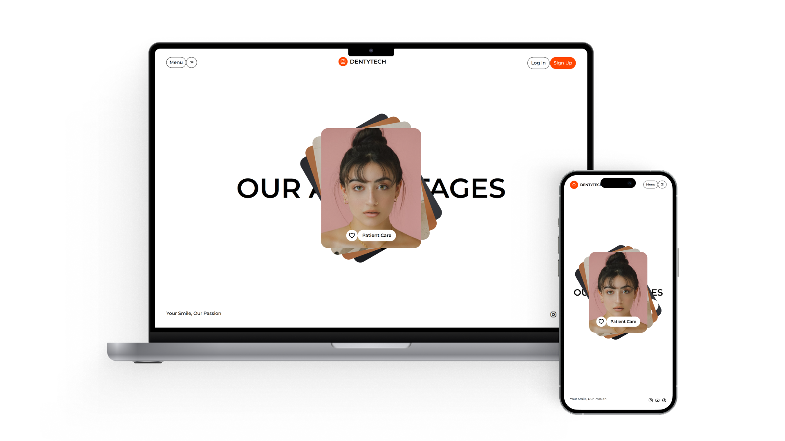

# DentyTech UI



**DentyTech UI** is a modern, responsive dental care landing page inspired by a clean and professional aesthetic. Built with **HTML**, **CSS (Tailwind CSS)**, and **JavaScript**, it features smooth animations, a striking hero section, and a focus on user experience.

---

## 🚀 Live Preview & Design

- **[Live Preview](https://dentytech-ui.vercel.app/)**
  <br>Experience DentyTech UI in action.

- **[Design Credit on Dribbble](https://dribbble.com/shots/22620941-Dental-Care-Landing-Page)**
  <br>View the original design inspiration.

---

## ✨ Features

- **Hero Section**: Eye-catching headline and animated advantages.
- **Animated Advantages**: Showcases key benefits with icons and transitions.
- **Navigation Bar**: Responsive navigation with menu and authentication buttons.
- **Footer**: Social media links and brand tagline.
- **Responsive Design**: Optimized for desktop and mobile.
- **Modern UI**: Uses custom fonts, Remix Icons, and smooth GSAP animations.

---

## 🛠️ Technologies Used

- **HTML**
- **CSS** (Tailwind CSS)
- **JavaScript**
- **GSAP** (for animations)
- **Remix Icon**

---

## ⚡ Installation

To run this project locally:

1. **Clone the repository:**
    ```bash
    git clone https://github.com/saad-shaikh-256/DentyTech-Ui.git
    ```

2. **Navigate to the project folder:**
    ```bash
    cd DentyTech-Ui
    ```

3. **Install dependencies:**
    ```bash
    npm install
    ```

4. **Start the development server:**
    ```bash
    npm run dev
    ```

5. **Open [http://localhost:5173](http://localhost:5173) in your browser.**

---

## 📝 Notes

- This project is a **frontend-only** landing page UI. It does not include backend functionality.
- You can extend this project by adding features like **contact forms**, **appointment booking**, or **backend integration**.
- If you find any issues or have suggestions, feel free to contribute or report them in the GitHub repository.

---

## 🚧 Future Enhancements

- Contact/appointment form
- Testimonials section
- Services detail pages
- Blog or news section
- Dark mode toggle

---

## 🙌 Credits

- **UI Design Inspiration:** [Dribbble Shot by Bogdan Falin](https://dribbble.com/shots/22620941-Dental-Care-Landing-Page)
- **Developed by [Saad Shaikh](https://saad-shaikh.vercel.app/)**

---

Feel free to suggest features, report bugs, or fork the project!
